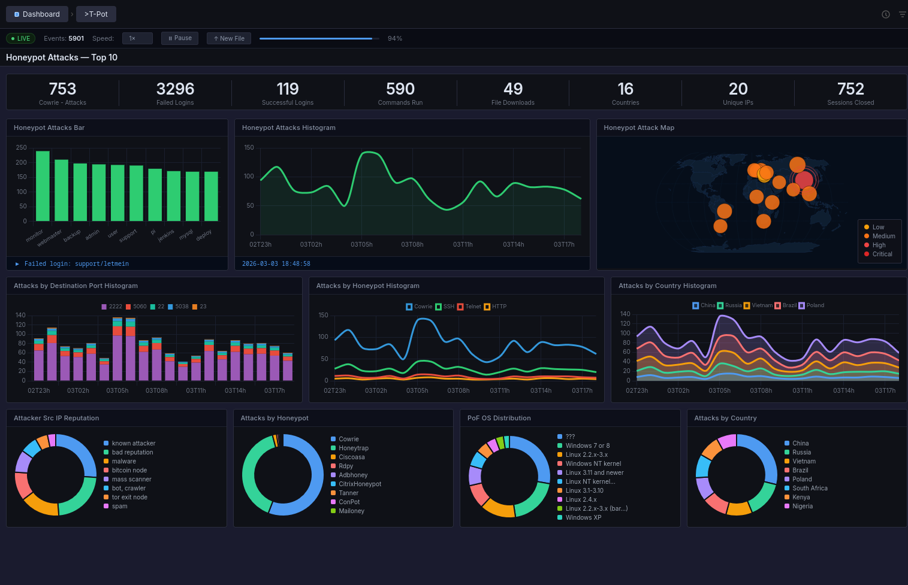
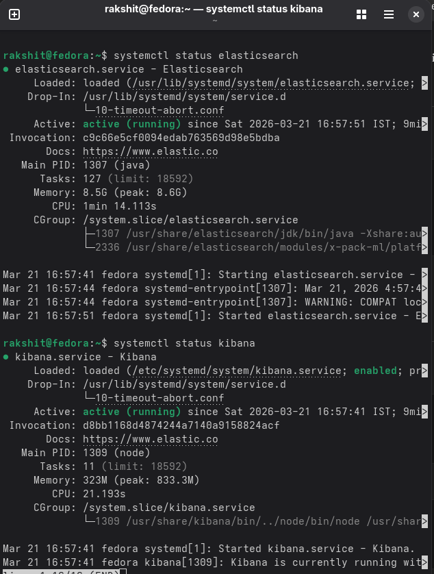
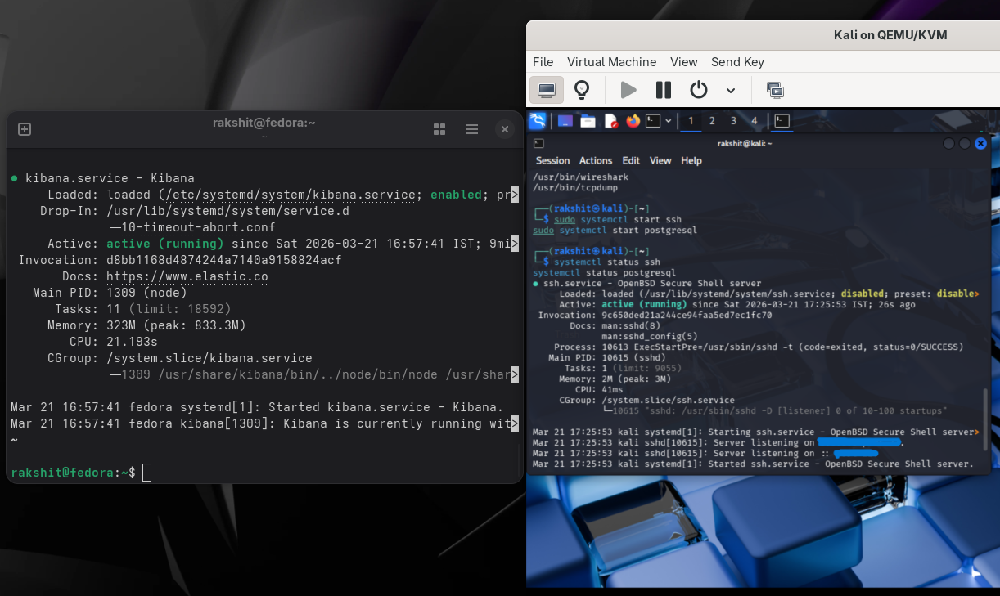

# 🛡️ Smart Honeypot Attack Monitoring System

> A fully integrated cybersecurity lab that attracts real attackers, captures their behavior, and transforms raw attack data into SOC-level analytics — built from scratch.


---

## 📸 Live Dashboard



A real-time SOC-style Kibana dashboard tracking **753 honeypot attacks**, **3,296 failed logins**, **590 commands executed**, and traffic from **16 countries** — generated by real unsolicited internet scanners plus simulated red-team traffic.

---

## 🧠 Core Objective

- ✅ Attract real adversaries with a believable SSH honeypot
- ✅ Capture full attack telemetry — credentials, commands, session behavior
- ✅ Analyze attacker patterns at scale
- ✅ Visualize insights in real time, SOC-analyst style

---

## 🧱 System Architecture

```
Kali Linux (Attacker / Red Team)
        │
        ▼
Cowrie Honeypot (Fedora Host)
        │  JSON logs
        ▼
   Filebeat  ──▶  Logstash (parse + GeoIP enrichment)
                        │
                        ▼
                 Elasticsearch (indexed storage)
                        │
                        ▼
                    Kibana (live SOC dashboard)
```

Every attacker interaction — login attempts, executed commands, file download attempts — is logged in structured JSON, shipped through Filebeat, enriched with GeoIP data in Logstash, indexed in Elasticsearch, and visualized live in Kibana.

---

## 📊 Dashboard & Analytics

The Kibana dashboard surfaces:

| Panel | What it shows |
|---|---|
| **Attack Timeline** | Spike detection across the monitoring window |
| **Top Attacker IPs** | Most active source IPs, ranked |
| **Global Attack Heatmap** | Geographic origin of every session 🌍 |
| **Credential Patterns** | Most-attempted username/password pairs |
| **Command Tracking** | Post-login shell commands (post-exploitation visibility) |
| **Attacker IP Reputation** | known attacker / malware / bot / tor exit-node classification |
| **OS Fingerprinting (p0f)** | OS distribution of connecting clients |


*Configuring the Cowrie index pattern in Kibana's Data Views.*


*Elasticsearch and Kibana running healthy on the Fedora host.*

---

## 😈 Attack Simulation (Kali Linux)

To generate realistic attack traffic for behavioral analysis, the lab includes:

- **SSH brute-force** using Hydra
- **Network reconnaissance** via Nmap
- **Manual SSH intrusion attempts**
- **Post-login command execution simulation**


*Kali Linux attacker VM alongside the Fedora honeypot host during a live session.*

---

## 📍 Key Observations

- Continuous brute-force campaigns targeting default credentials (`root`/`admin`)
- Automated, bot-driven attack cycles with identifiable timing patterns
- Post-authentication reconnaissance behavior
- External payload download attempts
- Geo-distributed attack sources spanning multiple regions and continents

---

## 🧰 Tech Stack

| Layer | Tool |
|---|---|
| Honeypot | [Cowrie](https://github.com/cowrie/cowrie) (SSH/Telnet) |
| Log Shipping | Filebeat |
| Parsing & Enrichment | Logstash (GeoIP) |
| Storage & Indexing | Elasticsearch |
| Visualization | Kibana |
| Attacker Environment | Kali Linux (QEMU/KVM) |
| Host OS | Fedora |

---

## ⚙️ Setup

> Tested on Fedora (host) + Kali Linux (attacker VM via QEMU/KVM).

```bash
# 1. Install Cowrie
git clone https://github.com/cowrie/cowrie
cd cowrie
python3 -m venv cowrie-env
source cowrie-env/bin/activate
pip install -r requirements.txt
cp etc/cowrie.cfg.dist etc/cowrie.cfg
bin/cowrie start

# 2. Install the ELK stack
sudo dnf install elasticsearch kibana filebeat logstash -y
sudo systemctl enable --now elasticsearch kibana

# 3. Point Filebeat at Cowrie's JSON logs
# edit /etc/filebeat/filebeat.yml -> paths: /home/cowrie/cowrie/var/log/cowrie/cowrie.json

# 4. Configure Logstash for GeoIP enrichment
# see config/logstash-cowrie.conf

sudo systemctl enable --now filebeat logstash

# 5. In Kibana -> Stack Management -> Data Views
# create an index pattern: cowrie*

# 6. Import the dashboard
# Kibana -> Stack Management -> Saved Objects -> Import -> dashboards/honeypot-dashboard.ndjson
```

---

## 🔐 Security Concepts Applied

- Honeypot-based deception systems
- Brute-force & reconnaissance pattern analysis
- Threat intelligence & attacker profiling
- Log pipeline engineering (Filebeat → Logstash → Elasticsearch → Kibana)
- SOC monitoring & detection thinking

---

## 💬 Key Insight

> Security isn't just about blocking attacks — it's about understanding attacker behavior, intent, and patterns.

---

## ⚠️ Disclaimer

This project was built in an isolated lab environment (Kali Linux VM as the only attacker source) for educational purposes. Do not deploy a honeypot on a production network or expose it directly to the internet without proper isolation, monitoring, and legal review.

---

## 📬 Connect

If you work in SOC, Threat Intelligence, or Security Engineering, I'd love to connect and exchange ideas.

**Rakshit Chaudhary** · 
[LinkedIn](https://www.linkedin.com/in/rakshit-chaudhary-aa689531b/)
